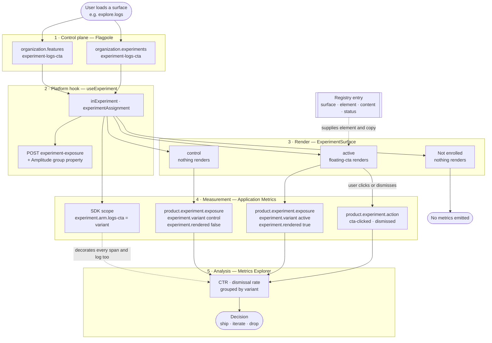
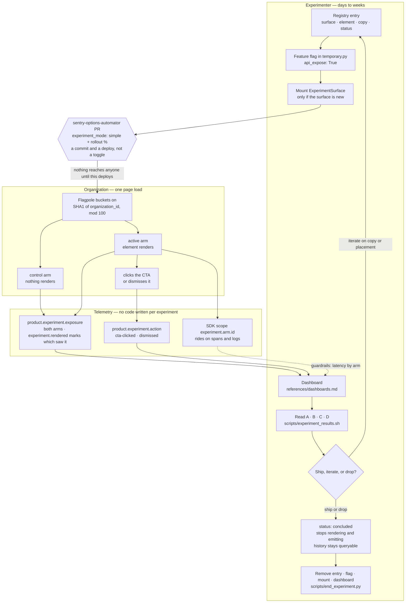

# Sendo Experiments Specification

> **Status: Hack Week 2026 proof of concept.** Every experiment is default-off in
> every environment. No production Flagpole rollout config exists, and no customer
> has been exposed to anything described here.

## Intent

Sentry already has assignment (Flagpole `experiment_mode`) and exposure
(`experiment.exposure` → `analytics.events_denormalized` → BigQuery). Both ship
today; `onboarding-scm-experiment` runs on them right now.

**Sendo is not a replacement for either. It is the layer above them: experiments
as data.**

An experiment becomes a registry entry plus a feature-flag line. No component
code, no metrics code, no hand-written attributes. The framework derives every
metric attribute from the registry, so a new experiment _cannot_ ship a typo'd
attribute, a missing exposure, or an inconsistent metric name. Instrumenting a
surface is one `<ExperimentSurface>` mount, once.

Nothing today does this. Every current experiment hand-wires its own component
branching and its own analytics.

| Plane       | System                         | Owner                                |
| ----------- | ------------------------------ | ------------------------------------ |
| Control     | Flagpole                       | Existing — eligibility, assignment   |
| Exposure    | `useExperiment`                | Existing — into BigQuery + Amplitude |
| Declaration | **Sendo registry**             | **New**                              |
| Measurement | **Sentry Application Metrics** | **New — exposure + interaction**     |
| Analysis    | Metrics Explorer / Dashboards  | New usage of existing tooling        |
| Debugging   | Tracing, errors, replay        | Existing — same surface              |

The goal is to prove one loop end to end:

```
segment → assignment → exposure → interaction → analysis → decision
```

It is explicitly not a complete experimentation platform; see
[Known Limitations](#known-limitations).

## Scope

In scope:

- Declaring an experiment (registry entry, feature flag, surface, element)
- Rendering an experiment's UI through the shared element catalog
- Emitting exposure and interaction metrics with a fixed attribute taxonomy
- Concluding and removing an experiment
- Reading results in Metrics Explorer

Out of scope:

- Statistical significance, confidence intervals, and SRM checks.
- Production Flagpole rollout config (the automator). Deliberately untouched.
- Any getsentry Python change — the entity handler, the exposure endpoint, the
  subscription/billing context.
- Backend-rendered or email-delivered experiences.
- Non-engineer authoring UI for segments and guides.

## Assignment Comes From Flagpole, Not From Us

Flagpole already has first-class experiment support. Sendo consumes it.

| Piece                                 | Where                                                   |
| ------------------------------------- | ------------------------------------------------------- |
| `ExperimentMode.SIMPLE`               | `src/flagpole/__init__.py:81`                           |
| `experiment_mode` on `Feature`        | `src/flagpole/__init__.py:130`                          |
| `experiment_mode` in the JSON schema  | `src/flagpole/flagpole-schema.json:49`                  |
| `get_experiment_assignments()`        | `src/sentry/features/manager.py:449`                    |
| `experiments` on the org payload      | `src/sentry/api/serializers/models/organization.py:765` |
| `experiments?: Record<string,string>` | `static/app/types/organization.tsx:115`                 |

`ExperimentMode.SIMPLE.get_assignment(flag_result)` returns `"active"` or
`"control"`. Sendo uses those strings verbatim, including in metric attributes,
rather than translating `active` to `treatment` — one less mapping to keep in
sync with the platform.

| `organization.experiments['experiment-logs-cta']` | Meaning       |
| ------------------------------------------------- | ------------- |
| key absent                                        | Not enrolled  |
| `'control'`                                       | Control arm   |
| `'active'`                                        | Treatment arm |

This is why **one flag is enough**. Enrollment is key presence; assignment is the
value. An earlier draft of this design used two paired flags to separate the two,
which was unnecessary.

Only `simple` mode exists. Two arms, organization scope. Multi-arm and user-level
experimentation are not implemented anywhere in the stack.

## Sendo Composes On The Platform Hook

`static/app/utils/useExperiment.tsx` already exists and already does assignment
and exposure. Sendo calls it. Sendo's own hook is named `useExperimentSurface`
specifically to avoid shadowing it.

The seam is the override registry (`static/app/overrideRegistry.tsx`):
`static/gsApp/registerOverrides.tsx:251` registers
`'react-hook:use-experiment'`, implemented at
`static/gsApp/overrides/useExperiment.tsx`. **That file is in this repo** —
`static/gsApp/` is 412 tracked files, aliased to `getsentry` in
`rspack.config.ts:509` and `tsconfig.json:57`.

What the SaaS implementation does:

```ts
// Gate on organization.features so that SENTRY_FEATURES, self.feature(),
// and devlocal.py all work without needing experiment-specific overrides.
const inExperiment = organization.features.includes(feature);

const assignment = organization.experiments?.[feature] ?? 'control';
const hasExperimentAssignment = organization.experiments?.[feature] !== undefined;
// → POST /organizations/{slug}/experiment-exposure/
// → Amplitude groupIdentify('organization_id', ...)
```

Three consequences shape Sendo's design:

1. **Render gating is features-based.** Sendo renders on `inExperiment`, not on
   `assignment === 'active'`, so it stays consistent with the platform and with
   local tooling. The cost is that render and variant can disagree when no entity
   handler is installed; the framework warns in dev and
   `analysis.md` has a query-side check.
2. **`hasExperimentAssignment` is the enrollment signal**, computed by gsApp and
   used to gate exposure — but not returned. Sendo needs it, because emitting a
   control exposure for every org that loads the page would flood the control arm
   with orgs that were never enrolled.
3. **gsApp's exposure dedup is a module-level `Set`** keyed
   `slug:feature:assignment`, so it survives client-side navigation. Sendo's
   per-mount dedup does not. The two counts differ by construction.

### Exposure timing is the platform's, not Sendo's

An earlier draft of this design claimed Flagpole logs exposure at flag evaluation
during page load, inflating denominators, and that fixing this was Sendo's
contribution. That was wrong. `reportExposure` is a required, reactive option on
`useExperiment` precisely so exposure fires when the user encounters a variant,
and `static/app/views/onboarding/onboarding.tsx:304` already uses it that way:

```tsx
const {inExperiment: hasScmOnboarding} = useExperiment({
  feature: 'onboarding-scm-experiment',
  reportExposure: isNewOrgOnboarding, // exclude orgs arriving via stale links
});
```

Backend paths suppress it with `skip_experiment_exposure=True`
(`src/sentry/features/manager.py:243`;
`src/sentry/api/serializers/models/organization.py:471` when serializing all flags).

Sendo passes `reportExposure` and inherits the correct behavior. Its additions are
declarative attribute derivation and interaction measurement.

## Experiment Semantics

These five concepts are distinct, and conflating them is the most common way to
produce a number that looks like a result but is not one.

| Concept         | Definition                                         | Where it lives                               |
| --------------- | -------------------------------------------------- | -------------------------------------------- |
| **Eligibility** | The org qualifies for the experiment at all        | Key present in `organization.experiments`    |
| **Assignment**  | Flagpole placed the org in control or active       | That key's value                             |
| **Exposure**    | A user actually encountered the experiment surface | `product.experiment.exposure` metric         |
| **Interaction** | The user clicked the CTA or dismissed the element  | `product.experiment.action` metric           |
| **Outcome**     | The behavior the experiment intends to change      | Not yet instrumented — see Known Limitations |

Two consequences, both load-bearing:

1. **Exposure is emitted for both arms.** Control users emit exposure with
   `rendered: false`. Without this the arms are not comparable, because you would
   have a denominator for active and none for control.
2. **Only the active arm can reach `product.experiment.action`.** Clicks and dismissals are
   structurally impossible for control, which is why CTR must be denominated on
   `rendered:true` rather than on all exposures.

## Architecture

One page load, traced across the planes. `logs-cta` is illustrative — the
registry ships empty, and an experiment is added when it runs:



Four things in that diagram are the whole design:

- **Assignment is read, not computed.** Flagpole decides; the frontend branches on
  a string it was handed.
- **Both arms reach plane 4.** Control renders nothing but still emits exposure.
  That shared denominator is what makes the arms comparable.
- **Plane 2 forks.** The platform's exposure record and Sendo's are siblings, not
  the same event. See [Three exposure records](#three-exposure-records).
- **The registry is a side input, not a step.** It supplies the element and copy
  without participating in assignment, which is what allows a new experiment to
  be pure data.

### Declarative registry

```ts
// static/app/utils/experiments/experiments.tsx
export const EXPERIMENTS = {
  'logs-cta': {
    surface: 'explore.logs',
    element: 'floating-cta',
    status: 'active',
    content: () => ({heading: ..., body: ..., ctaLabel: ..., ctaTarget: ...}),
  },
} satisfies Record<string, ExperimentDefinition>;
```

This mirrors the aggregation pattern already used by
`static/app/utils/analytics.tsx`, which combines per-domain event maps into one
typed registry.

The registry is the reason this is maintainable. Because `experiment.id`,
`experiment.variant`, `experiment.surface`, and `experiment.element` are all
derived from the registry entry,
**metric emission lives in the framework, not in the experiment**. A new
experiment cannot ship with a typo'd attribute, a missing exposure event, or an
inconsistent metric name, because it does not write any metrics code.

### Convention-derived flag

| Experiment id | Flag                                | `experiments` key     |
| ------------- | ----------------------------------- | --------------------- |
| `logs-cta`    | `organizations:experiment-logs-cta` | `experiment-logs-cta` |

The `experiment-` prefix means every experiment flag sorts together in
`temporary.py`, greps as a group, and can be audited or deleted as a group. That
prefix is also why a dedicated `experiments.py` module is unnecessary —
`temporary.py`'s docstring ("THESE FLAGS ARE INTENDED TO BE REMOVED … CLEAN UP
YOUR FEATURE FLAGS!") describes an experiment flag exactly, and moving them out
would put concluded experiments outside that cleanup spotlight.

Flags are registered with `api_expose=True`, and this is load-bearing rather than
incidental. An experiment's two halves arrive by different routes:
`get_experiment_assignments()` populates `organization.experiments` regardless of
`api_expose`, but `organization.features` is built from
`features.all(api_expose_only=True)`
(`src/sentry/api/serializers/models/organization.py:459`), which consults
`exposed_features` (`src/sentry/features/manager.py:151`, `:214`).

Because `useExperiment` gates `inExperiment` — the render decision — on
`organization.features`, registering with `api_expose=False` would leave the
element permanently unrendered in every environment while assignment still
resolved. An earlier draft of this design specified `api_expose=False`, reasoning
that assignment does not need it; that reasoning was correct in isolation and
wrong in effect, because it ignored the render gate. Every experiment flag
shipping today uses `api_expose=True`.

Flagpole rollout config is **commit-gated**. Registering a FLAGPOLE feature here
auto-registers a backing option marked `FLAG_AUTOMATOR_MODIFIABLE`, but the
segments and rollout YAML live in the separate `sentry-options-automator` repo
(see the default path at `src/flagpole/flagpole_eval.py:71`) and ship through
GoCD. With no entry there, the option defaults to `{}`, the flag evaluates to
`False`, and nothing renders. **Default-off is structural, not a convention** —
this POC cannot reach a customer without a PR landing in another repo.

The corollary: the kill switch is a commit plus a deploy, not a button.

### Surface-keyed mounting

```tsx
<ExperimentSurface surface="explore.logs" />
```

It renders whichever active experiment the registry assigns to that surface. Once
a surface is instrumented, adding an experiment there is a registry entry plus one
flag line, with no component code at all. That is the property that makes this
safe to drive from a skill.

Surface names are not invented. `static/app/components/analyticsArea.tsx` provides
a nesting string context with a dotted convention (`explore.logs`,
`feedback.details`), and the logs page already declares
`<AnalyticsArea name="explore.logs">` at
`static/app/views/explore/logs/content.tsx:60`. Sendo reuses those names so its
`experiment.surface` attribute is joinable with ordinary analytics.

Sendo keeps its own typed `Surface` union rather than reading
`useAnalyticsArea()` directly — that component's docstring says app logic "should
not change or branch off of this value," and the union gives compile-time safety.
A dev-only assertion warns when the two disagree.

### Element catalog

Experiments do not ship bespoke UI. They select from a small catalog, so visual
treatment stays consistent and reviewable:

| Element        | Description                                           | Status  |
| -------------- | ----------------------------------------------------- | ------- |
| `floating-cta` | Dismissible floating window with heading, body, CTA   | Built   |
| `page-banner`  | Inline banner over `components/alerts/pageBanner.tsx` | Planned |

Copy and links live in the registry entry's `content`. They must never flow into
metric attributes.

## Lifecycle

The architecture above is one page load. This is one experiment, from declaration
to teardown — two actors on very different clocks, meeting where telemetry
becomes results.



Four things in that picture are worth stating outright:

- **The gate is a deploy, not a toggle.** Nothing reaches a single organization
  until a `sentry-options-automator` PR lands and ships. The same is true in
  reverse: turning an experiment off through Flagpole is another commit and
  another deploy. Plan the abort path before the rollout, not during it.
- **The two lanes never touch each other's code.** The experimenter writes a
  registry entry and a flag. The organization's page emits exposure and
  interaction metrics. Nobody writes metrics code in between, which is the
  property the whole design exists to buy.
- **Both arms produce telemetry.** Control emits exposure with
  `experiment.rendered: false`, which is what makes the arms comparable at all.
  An experiment where only the treatment arm reports has no denominator.
- **Concluding and removing are separate steps.** `status: 'concluded'` stops
  rendering and emission while leaving history queryable, so it is safe to do the
  moment a decision is made. Teardown comes later, once the numbers live
  somewhere durable — deleting the dashboard removes the only place anyone was
  reading them.

The loop back from the decision is the common case. Most experiments iterate on
copy or placement before they ship or drop, and each iteration is a registry edit
rather than a new component.

## Three Exposure Records

**Sendo is the third system recording that an org saw an experiment.** This must
be stated whenever results are presented.

|             | gsApp exposure                                                | Amplitude group property | Sendo exposure            |
| ----------- | ------------------------------------------------------------- | ------------------------ | ------------------------- |
| Destination | `analytics.events_denormalized` → BigQuery                    | Amplitude org group      | Application Metrics       |
| Fires when  | enrolled only                                                 | enrolled only            | enrolled, both arms       |
| Dedup       | module `Set`, `slug:feature:assignment` — survives navigation | same                     | per component mount       |
| Means       | user _encountered_ the experiment                             | org's current arm        | element _render decision_ |

They will not agree, by construction. Sendo's is a render record; the platform's
is an encounter record. Both are legitimate. Conflating them is not.
`analysis.md` cross-checks the ratio rather than expecting equality.

## Runtime Contract

- Required first action: read the registry before creating anything, and reuse an
  existing experiment id rather than duplicating one.
- Required outputs: a registry entry, one flag registration, and — only if the
  surface is not yet instrumented — one mount line.
- Non-negotiable constraints:
  - Experiments are default-off. Never add rollout config to the automator.
  - Assignment is read through `useExperiment`, never recomputed.
  - Exposure fires once per mount per user, for both arms.
  - Metric attribute values are bounded string unions. No URLs, no copy, no
    org slugs, no free text.
  - Dismissal state is client-side only (`localStorage`) for the POC.

## Source And Evidence Model

Authoritative sources:

- `static/app/utils/experiments/` — registry, types, Sendo hook, metrics, elements
- `static/app/utils/useExperiment.tsx` — platform hook and OSS fallback
- `static/gsApp/overrides/useExperiment.tsx` — SaaS implementation
- `static/app/components/analyticsArea.tsx` — surface naming convention
- `src/sentry/features/temporary.py` — flag registration
- `src/sentry/features/manager.py:449` — `get_experiment_assignments()`
- `src/flagpole/__init__.py:81` — `ExperimentMode`
- `src/flagpole/conditions.py:364` — `in_rollout()`
- `static/app/types/organization.tsx:115` — `experiments` on the org payload

Data that must not be stored in metric attributes, registry content, commits, or
PR descriptions:

- Customer organization slugs, names, or IDs
- User emails or any customer-identifying value
- Arbitrary URLs or user-authored strings

## Reference Architecture

- `SKILL.md` — routing table, the add/conclude/remove procedures, constraints
- `platform.md` — how Flagpole, `useExperiment`, gsApp, the BigQuery
  pipeline, and the BI `ab_testing` dataset relate; what is and is not in this repo
- `metrics.md` — the metric and attribute taxonomy
- `analysis.md` — Metrics Explorer queries and what they support
- `recipes.md` — runnable answers to recurring operational questions
- `dashboards.md` — reusable dashboard template and the API rules it obeys
- `local-setup.md` — running it locally, and the traps

## Validation

- **Lightweight:** TypeScript rejects unknown experiment ids, surfaces, elements,
  and attribute values at compile time.
- **Structural:** a frontend registry-invariants test asserts unique ids,
  kebab-case, and at most one `status: 'active'` experiment per surface.

  There is deliberately **no** cross-language test asserting every `experiment-*`
  flag has a registry entry. The registry is TypeScript and the flag is Python;
  parsing `.tsx` from pytest is brittle, and both failure modes are benign — a
  missing flag means the experiment never activates (fails safe), and an orphaned
  flag is one dead line in `temporary.py`.

- **Behavioral:** colocated tests assert exposure fires exactly once per mount,
  fires for control with `rendered: false`, does not re-fire on rerender, and that
  the dev warning fires when the feature is on with no assignment.
- **End to end:** with `SENDO_LOCAL_FLAGPOLE=1`, the element renders and metrics
  arrive in the configured test project.

## Known Limitations

State these plainly whenever results are presented.

### Sendo's own

- **Sendo is the third exposure record.** See
  [Three exposure records](#three-exposure-records).
- **No outcome instrumentation.** This measures element engagement, not causal
  lift. "Shown → clicked" is a CTR, not an experiment result. A genuine experiment
  needs a downstream outcome observable in _both_ arms — for the logs case,
  `control/active → logs setup started → logs sent successfully`. The registry has
  a natural home for it (`outcome`). **Highest-value follow-up**, and note that
  `ab_testing.experiment_events` currently has 0 rows, so outcome measurement is
  missing platform-wide, not just here.
- **No statistics.** No significance testing, confidence intervals, statistical
  power, or SRM checks. Do not describe a difference between arms as real.
- **Counts, not funnels, by default.** Metrics are counts, so repeated page views
  by one user inflate exposure. The SDK does attach `user.id` and `organization`
  globally, so de-duplicated per-user and per-org analysis is available — but no
  query here does it yet, and the raw counts do not.
- **Assignment is org-level; counting is per-user-per-pageview.** Observations
  within an org are correlated, so CTR denominators are not independent samples
  and any naive test badly understates variance. This is a design property of
  org-scoped experimentation, not a bug in Sendo.
- **Render gating and variant can disagree** when no entity handler is installed.
  The element renders off `organization.features` while `experimentAssignment`
  falls through to `'control'`. Mitigated by a dev warning and an analysis-side
  check, not eliminated.
- **Dismissal is client-side.** Clearing `localStorage` or switching browsers
  resets it, which biases dismissal rate downward.
- **Guardrails can compare latency but not errors.** The arm is on the SDK scope
  as an attribute, so spans, logs, and metrics carry it — error events do not,
  because those need tags. Comparing error rate between arms is not possible
  without also setting a tag.
- **No experiment result or decision UI.** Analysis is manual.
- **No audit history** beyond git and the registry's `status` field.

### Inherited from the platform — report, do not fix

- **Rollout bucketing omits the feature name.** `src/flagpole/conditions.py:364`
  buckets on `context.id % 100 <= self.rollout`, where `context.id` is a SHA1
  digest of the identity fields (`organization_id`) read as an integer — the
  feature name is not part of it.
  Two flags with identical conditions and rollout select the _same_ organizations,
  so concurrent experiments at the same rollout are perfectly confounded. Fixing
  it globally would reshuffle ordinary feature flags, so it needs
  experiment-specific bucketing or versioning.
- **Rollout comparison is inclusive.** `rollout: 50` matches buckets 0–50 — 51 of 100. Arms are 51/49.
- **`UseExperimentResult` cannot express "not enrolled"** even though gsApp
  computes it as `hasExperimentAssignment`.
- **getsentry's Python is not exercised here.** Its entity handler, the
  `/organizations/{slug}/experiment-exposure/` endpoint, and the
  subscription/billing context properties Flagpole segments condition on all live
  in a separate private repo. The frontend path, including gsApp's override, _is_
  fully runnable locally, and `SENDO_LOCAL_FLAGPOLE=1` runs the real Flagpole
  evaluation engine against a local config — so what remains untested here is
  getsentry's handler implementation and its billing context, not bucketing or
  assignment.
- **Assignment authority is split.** The Flagpole-native path and the BI tool's
  cohorts in the `super-big-data.ab_testing` BigQuery dataset are not
  automatically the same assignment. See `platform.md`.

Long-term direction: one system owns assignment, the experiment key enters the
bucketing hash, exposure semantics are preserved, and one canonical
assignment/exposure model feeds BigQuery and Amplitude.

## Maintenance Notes

- Update `SKILL.md` when the add/conclude/remove procedure changes, or when a new
  element joins the catalog.
- Update `metrics.md` when an attribute is added — and only add
  attributes with bounded value sets.
- When an experiment concludes, follow the removal procedure in `SKILL.md` rather
  than leaving a dead registry entry in place.
- If `UseExperimentResult` gains an `isEnrolled` field, delete Sendo's direct read
  of `organization.experiments` rather than leaving two enrollment checks.
